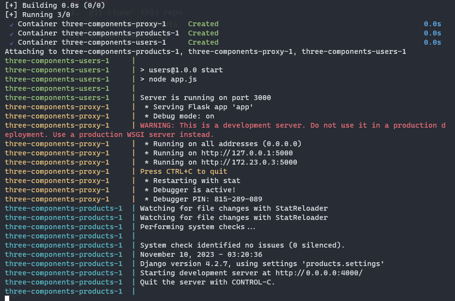

# three-components
A small project with 3 components, a Django front-facing, a Flask proxy and an Express API

# Summary
- API with Express and Node.js: `users`
    - API-to-Database Connection: uses `knex` as an ORM
    - Connect your Express API to a SQLite database using any ORM
    - Store and retrieve "User" data
- Web Server with Django and Python: `products`
- API Proxy with Python: `proxy` using `Flask`

# How to set up the app
## Prerequisites
- Docker version ^24.0.2, build cb74dfc
- Docker Compose version ^2.18.1
- SQLite3 shell if you want to init your own table
- My sample `users.sqlite3` db file is included in this app

## Steps
1. `git clone` this repo
2. `cd three-components`
3. `docker compose up`  
If you see this screen, then the app is started successfully  


## Make CRUD operations to the Django server
1. Get all users:
```bash
curl --location 'localhost:4000/users/'
```
2. Get one user:
```bash
curl --location 'localhost:4000/users/6/'
```
3. Create a user:
```bash
curl --location 'localhost:4000/users/' \
--header 'Content-Type: application/json' \
--data-raw '{
    "name":"homebase",
    "email":"homebase@mail.com",
    "password":"123"
}'
```
4. Update a user:
```bash
curl --location --request PATCH 'localhost:4000/users/6/' \
--header 'Content-Type: application/json' \
--data '{
    "name":"Steph Curry"
}'
```
5. Delete a user:
```bash
curl --location --request DELETE 'localhost:4000/users/6/'
```
# Notes
Due to the time constraint, I was only able to set up the bare minimum for this app such as the CRUD operations and proxy forwarding. Some improvements I think could be done with more time:

- Error handling
    - Handling error when something is wrong the database connection
- Data validation
- Authorization and Authentication
- Some configs are being hard-coded
- More code modularity
- Create a model for `products` so that we can get a list of purchases of users
